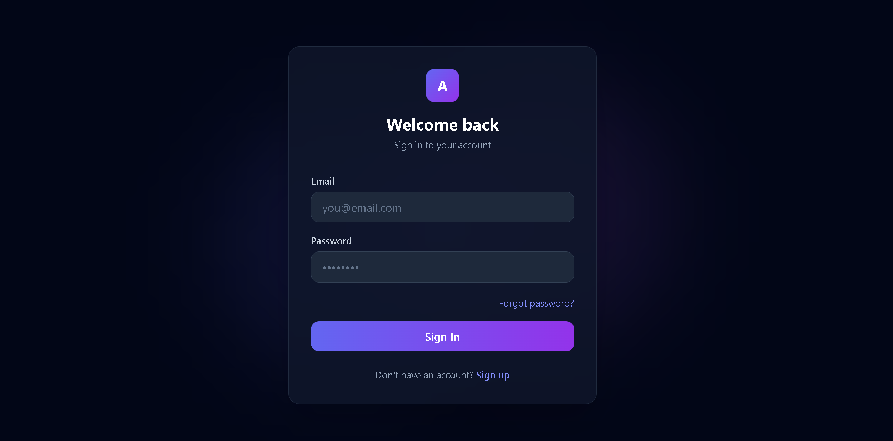
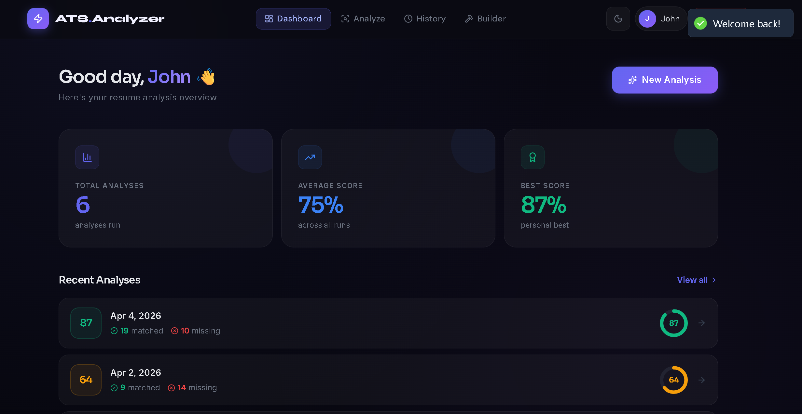
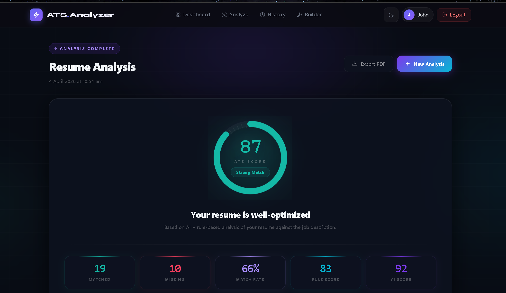
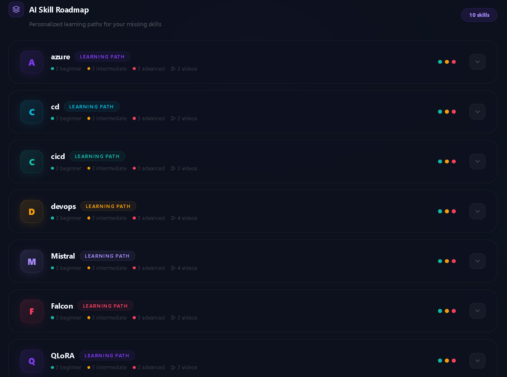
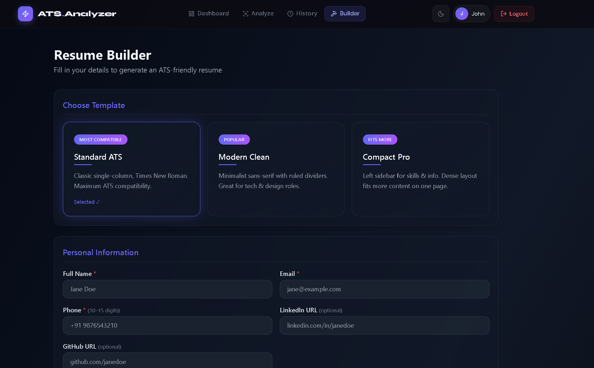
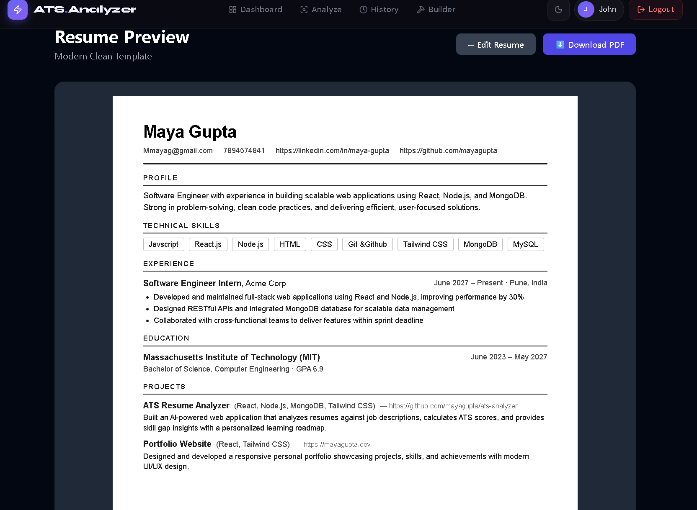

<div align="center">


# 🧠 ATS Resume Analyzer & Builder

### *AI-powered resume analysis that tells you exactly why you're getting rejected — and how to fix it.*

[](https://reactjs.org/)
[](https://nodejs.org/)
[](https://expressjs.com/)
[](https://www.mongodb.com/)
[](https://tailwindcss.com/)
[](https://groq.com/)

[](https://opensource.org/licenses/MIT)
[](https://github.com/gayatri-nawale/ATS-analyzer/stargazers)
[](https://github.com/gayatri-nawale/ATS-analyzer/issues)
[](https://github.com/gayatri-nawale/ATS-analyzer/commits/main)

<br/>


</div>

---

##  About The Project

**ATS Resume Analyzer & Builder** is a full-stack MERN application that empowers job seekers to optimize their resumes for Applicant Tracking Systems (ATS). Upload your resume, paste a job description, and receive an instant ATS compatibility score, skill gap analysis, AI-powered improvement suggestions, and a personalized learning roadmap — all in one place.

> 💡 **Did you know?** Over **75% of resumes are rejected by ATS before a human ever reads them.** This tool helps you beat the algorithm.

### Why This Project?

-  Most candidates don't know **why** their resume gets filtered out
-  Manual skill matching is **time-consuming and error-prone**
-  Existing tools are either **too expensive** or **too basic**
-  This app provides **end-to-end resume optimization** — for free

---

##  Features

| Feature | Description |
|---|---|
|  **Resume Upload** | Upload PDF resumes (up to 10MB) with drag & drop support |
|  **ATS Score Calculation** | Intelligent scoring algorithm comparing resume vs job description |
|  **Skill Gap Analysis** | Visual breakdown of matched vs missing skills by category |
|  **AI Suggestions** | Groq-powered personalized improvement recommendations |
|  **Learning Roadmap** | Structured beginner → intermediate → advanced learning paths |
|  **YouTube Integration** | Curated video resources for every missing skill |
|  **Resume Builder** | Build ATS-optimized resumes with 3 professional templates |
|  **Dashboard & History** | Track all past analyses with scores and trends |
|  **Dark / Light Mode** | Full theme toggle with smooth transitions |
|  **PDF Download** | Export your resume or ATS report as PDF |

---

## Tech Stack

### Frontend


### Backend


### AI & Integrations


---

## 📸 Screenshots / Demo

> 🔗 **Live Demo:** https://ats-analyzer.vercel.app

<table>
  <tr>
    <td align="center"><b> Login Page</b></td>
    <td align="center"><b> Dashboard</b></td>
  </tr>
  <tr>
    <td></td>
    <td></td>
  </tr>
  <tr>
    <td align="center"><b> ATS Result & Skill Gap</b></td>
    <td align="center"><b> AI Learning Roadmap</b></td>
  </tr>
  <tr>
    <td></td>
    <td></td>
  </tr>
  <tr>
    <td align="center"><b> Resume Builder</b></td>
    <td align="center"><b> Resume Preview</b></td>
  </tr>
  <tr>
    <td></td>
    <td></td>
  </tr>
</table>


## Installation

### Prerequisites

Make sure you have the following installed:

-  
- 
- 

### 1️⃣ Clone the Repository

```bash
git clone https://github.com/gayatri-nawale/ATS-analyzer.git
cd ATS-analyzer
```

### 2️⃣ Install Server Dependencies

```bash
cd server
npm install
```

### 3️⃣ Install Client Dependencies

```bash
cd ../client
npm install
```

### 4️⃣ Configure Environment Variables

Create a `.env` file inside the `server/` directory:

```bash
cd ../server
touch .env
```

Then fill in your values (see [Environment Variables](#-environment-variables) section below).

### 5️⃣ Run the Application

**Start the backend server:**
```bash
cd server
npm run dev
```

**Start the frontend (in a new terminal):**
```bash
cd client
npm run dev
```

**Access the app:**

| Service | URL |
|---|---|
| Frontend | http://localhost:5173 |
| Backend API | http://localhost:5000 |

---

## 🔐 Environment Variables

Create `server/.env` with the following variables:

```env
# ─── Server ─────────────────────────────────────────
PORT=5000
# ─── Database ────────────────────────────────────────
MONGO_URI=mongodb+srv://<username>:<password>@cluster.mongodb.net/ats-analyzer

# ─── Authentication ──────────────────────────────────
JWT_SECRET=your_super_secret_jwt_key_here

# ─── AI Integration ──────────────────────────────────
GROQ_API_KEY=your_groq_api_key_here

# ─── Email (Optional) ────────────────────────────────
MAIL_USER=your_email@gmail.com
MAIL_PASS=your_app_password
```

> ⚠️ **Never commit your `.env` file to version control!** It's already included in `.gitignore`.

**How to get API Keys:**
-  **Groq API Key** → [console.groq.com](https://console.groq.com) → Create API Key
-  **MongoDB URI** → [MongoDB Atlas](https://cloud.mongodb.com) → Create free cluster

---

##  Usage Guide

### Analyzing Your Resume

1. **Sign up / Log in** to your account
2. Navigate to **Analyze** tab
3. **Upload your resume** (PDF, max 10MB) by drag & drop or click to browse
4. **Paste the job description** you're applying for
5. Click **"Analyze Resume →"**
6. View your **ATS Score**, matched/missing skills, AI suggestions, and learning roadmap

### Building a Resume

1. Navigate to the **Builder** tab
2. **Choose a template**: Standard ATS, Modern Clean, or Compact Pro
3. Fill in your **personal info, experience, education, skills, and projects**
4. Click **"Preview Resume"** to see the live preview
5. Click **"Download PDF"** to save your resume

### Tracking Progress

- Visit the **History** tab to see all past analyses
- Track your score improvements over time
- Click any analysis to revisit full results

---

##  Folder Structure

```
ats-analyzer/
│
├── 📁 client/                         # React Frontend
│   ├── 📁 public/
│   ├── 📁 screenshots/                # App screenshots
│   │   ├── builder.png
│   │   ├── dashboard.png
│   │   ├── login.png
│   │   ├── preview.png
│   │   ├── result.png
│   │   ├── result2.png
│   │   ├── result3.png
│   │   └── result4.png
│   └── 📁 src/
│       ├── 📁 assets/                 # Static assets
│       ├── 📁 components/             # Reusable UI components
│       │   ├── CompactTemplate.jsx
│       │   ├── ModernTemplate.jsx
│       │   ├── Navbar.jsx
│       │   ├── PDFReport.jsx
│       │   ├── ResumeForm.jsx
│       │   ├── RoadmapCard.jsx
│       │   ├── RoadmapSection.jsx
│       │   ├── StandardTemplate.jsx
│       │   ├── TemplateRenderer.jsx
│       │   └── VideoCard.jsx
│       ├── 📁 pages/                  # Route-level page components
│       │   ├── Analyze.jsx
│       │   ├── Builder.jsx
│       │   ├── Dashboard.jsx
│       │   ├── ForgotPassword.jsx
│       │   ├── History.jsx
│       │   ├── Login.jsx
│       │   ├── Preview.jsx
│       │   ├── ResetPassword.jsx
│       │   ├── Result.jsx
│       │   ├── Signup.jsx
│       │   └── VerifyOTP.jsx
│       ├── 📁 pdf/                    # PDF template components
│       │   ├── CompactPDF.jsx
│       │   ├── ModernPDF.jsx
│       │   └── StandardPDF.jsx
│       ├── 📁 store/                  # Zustand state management
│       │   ├── authStore.js
│       │   └── themeStore.js
│       ├── 📁 utils/
│       │   ├── api.js                 # Axios API client
│       │   └── pdfGenerator.js        # Client-side PDF export
│       ├── App.css
│       ├── App.jsx
│       ├── index.css
│       └── main.jsx
│   ├── .gitignore
│   ├── eslint.config.js
│   ├── index.html
│   ├── package.json
│   ├── package-lock.json
│   ├── postcss.config.js
│   ├── tailwind.config.js
│   └── vite.config.js
│
├── 📁 server/                         # Node.js + Express Backend
│   ├── 📁 config/
│   │   ├── db.js                      # MongoDB connection
│   │   └── mail.js                    # Email configuration
│   ├── 📁 controllers/
│   │   ├── analysisController.js      # Resume analysis logic
│   │   └── authController.js          # Auth logic
│   ├── 📁 middleware/
│   │   └── authMiddleware.js          # JWT verification
│   ├── 📁 models/
│   │   ├── Analysis.js                # Analysis schema
│   │   └── User.js                    # User schema
│   ├── 📁 routes/
│   │   ├── analysisRoutes.js
│   │   └── authRoutes.js
│   ├── 📁 services/
│   │   ├── ai.js                      # Groq AI integration
│   │   ├── keyword.js                 # Keyword extraction
│   │   ├── matcher.js                 # Skill matching logic
│   │   ├── parser.js                  # PDF text extraction
│   │   └── youtube.js                 # YouTube video fetching
│   ├── 📁 uploads/                    # Temporary resume storage
│   │   └── .gitkeep
│   ├── 📁 utils/
│   │   └── logger.js
│   ├── .env                           # Environment variables (not committed)
│   ├── app.js
│   ├── package.json
│   ├── package-lock.json
│   └── server.js
│
├── .gitignore
└── README.md
```


## 🧠 How It Works

```
┌─────────────────────────────────────────────────────────────┐
│                     ATS ANALYSIS PIPELINE                   │
└─────────────────────────────────────────────────────────────┘

    Resume PDF                   Job Description
       │                                │
       ▼                                ▼
  ┌─────────┐                   ┌────────────────┐
  │ pdf-    │                   │ Keyword        │
  │ parse   │                   │ Extractor      │
  └────┬────┘                   └───────┬────────┘
       │                                │
       ▼                                ▼
  ┌─────────────────────────────────────────┐
  │           Skill Matcher Engine          │
  │  • Exact match  • Synonym matching      │
  │  • Category grouping (Cloud, ML, DB..)  │
  └──────────────────┬──────────────────────┘
                     │
                     ▼
  ┌─────────────────────────────────────────┐
  │          ATS Score Calculator           │
  │  Score = (matched / total) × 100        │
  └──────────────────┬──────────────────────┘
                     │
                     ▼
  ┌─────────────────────────────────────────┐
  │           Groq AI Analysis              │
  │  • Personalized suggestions             │
  │  • Section-by-section feedback          │
  │  • Missing skill identification         │
  └──────────────────┬──────────────────────┘
                     │
                     ▼
  ┌─────────────────────────────────────────┐
  │         YouTube Roadmap Generator       │
  │  • Fetch videos per missing skill       │
  │  • Beginner → Intermediate → Advanced   │
  └──────────────────┬──────────────────────┘
                     │
                     ▼
                Final Result
         (Score + Skills + Roadmap)
```

<div align="center">

**SHARAD SHELKE**

[](https://github.com/Sharadshelke8286)

[](https://www.linkedin.com/in/sharad-shelke-44009b2ab/)
</div>

---
